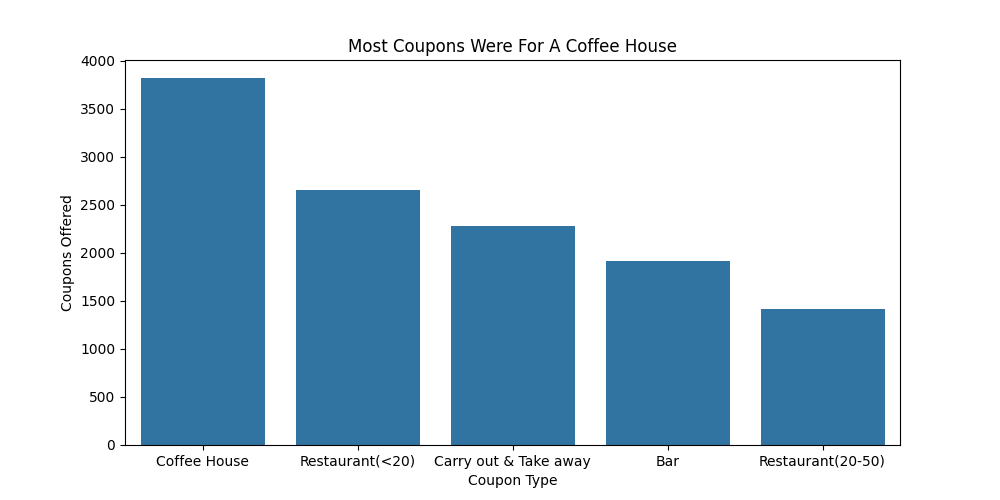
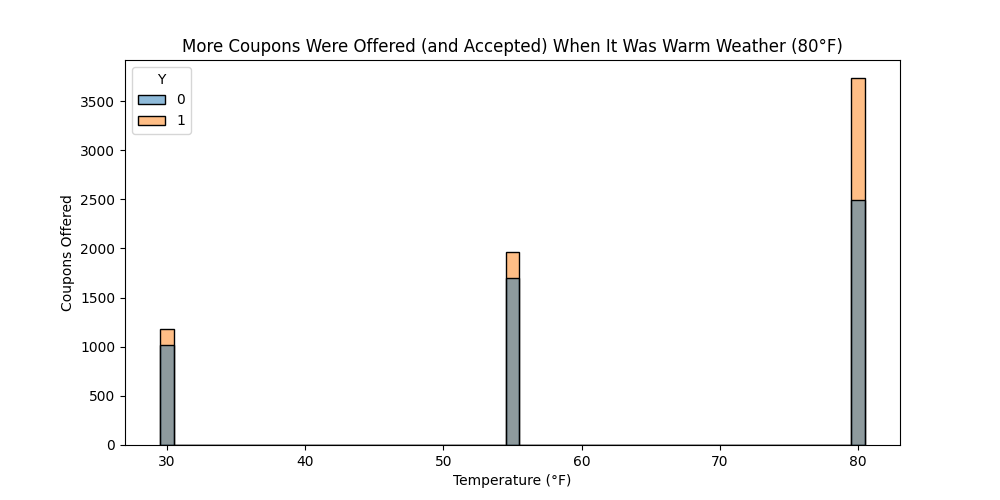
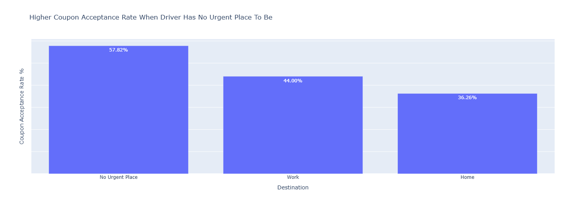

# Will the Customer Accept the Coupon
[View Jupyter Notebook](Will_the_Customer_Accept_the_Coupon.ipynb)
### Problem Statement
The local bars and coffee shops have asked me for help in exploring this coupon dataset to gain a better understanding of the characteristics of customers who accepted a coupon they received versus those that did not, and to use these insights to help them make better decisions about what they should focus on when sending out their coupons.
### Data Cleaning
The first stage involved cleaning the data. Most of the data was fairly clean, but there was a car column that contained 99.15% missing values. The car column was not really useful for this data analysis, so I decided to remove it from the data. There were some other columns with missing values (i.e. Bar, CoffeeHouse, CarryAway, RestaurantLessThan20, Restaurant20to50), but luckily the missing values made up less than 2% for these respective columns. These columns showed how many times a month the driver went to these places which made it difficult to impute these missing values, so I decided to drop these missing value rows from the data as it only made up a small portion of the overall dataset.
### EDA
The cleaned dataset consisted of 12,079 rows and 25 columns. Overall, out of the 12,079 coupons offered **56.93%** were accepted. In terms of distribution of coupon types, most of the coupons were for Coffee Houses as shown in the image below.

The surveys also included a temperature column that was either 30, 55, or 80 degrees Fahrenheit depending on the weather when the coupon was issued. The image below shows that most coupons were offered and accepted when the weather was warm at 80 degrees Fahrenheit.

### Findings (Bar Coupons)
Looking at only the coupons for Bars, the overall coupon acceptance rate was **41.19%**. Analyzing the data with different conditions revealed:
- Drivers who went to a bar 3 or fewer times a month had an acceptance rate of 37.27%.
- Drivers who went to a bar more than 3 times a month had an acceptance rate of 76.17%.
- Drivers who go to a bar more than once a month AND are older than 25 had an acceptance rate of 68.98%.
- Drivers who go to bars more than once a month AND had passengers other than a kid AND had occupations other than farming, fishing, or forestry had an acceptance rate of 71.43%.
- Drivers who go to bars more than once a month AND had passengers other than a kid AND were not widowed had an acceptance rate of 71.43%
- Drivers who go to bars more than once a month AND are younger than 30 had an acceptance rate of 71.95%
- Drivers who go to cheap restaurants more than 4 times a month AND have income less than $50K had an acceptance rate of 45.65%
#### Actionable Items (Bar Coupons)
The bar business owners should focus their coupons on drivers who go to bars more than once a month since they are much more likely to accept the bar coupons. This appeared to be the strongest variable affecting the acceptance rate.

Other variables like having a passenger in the car and age of the driver seemed to also have an impact on the acceptance rate, but not as strongly as how many times the driver went to bars in a month (decreased to 68.98% when age was filtered to be older than 25, then up to 71.43% when the data was filtered to check for a passenger other than a kid in the car).

Occupation and marital status didn't appear to have much of an impact on the acceptance rate as we can interestingly see the same acceptance rate of 71.43% when occupation was not farming, fishing, or forestry vs when the driver wasn't a widow.

As soon as we remove the filter about how often the driver goes to bars in a month, we see the acceptance rate drop down to 45.65% in the last bullet point, essentially confirming that the variable having the biggest impact is how often the driver goes to bars in a month.

### Findings (Coffee House Coupons)
Looking at only the coupons for Coffee Houses, **49.63%** of coffee coupons were accepted by drivers. Then I investigated the coffee coupon acceptance rates with additional variables and found:
- Drivers with no urgent place to be had a higher acceptance rate of 57.82%
- Drivers going to work had a lower acceptance rate of 44%
- Drivers heading home had the lowest acceptance rate of 36.26%

Then I wondered if the driving direction would have any impact for the drivers going to work or home and found:
- Drivers going to work with coupons for coffee shops in the same direction had a 56.93% acceptance rate vs 32.91% for coffee shops in the other direction.
- Drivers heading home with coupons for coffee shops in the same direction had a 47.12% acceptance rate vs 30.38% for coffee shops in the other direction.

I also wanted to see if the coupon expiration dates and gender of the driver made any difference:
- 1 day expiration coupons had an acceptance rate of 58.06%.
- 2 hour expiration coupons had an acceptance rate of 42.91%.
- Males had an acceptance rate of 50.19%.
- Females had an acceptance rate of 49.11%.

#### Actionable Items (Coffee House Coupons)
The coffee house business owners should definitely focus on drivers who have no urgent place to be as they had much higher acceptance rates, and for the drivers going to work or home, they should try to deliver the coupon to the drivers as they are going in the same direction of their destination since this showed much higher acceptance rates.

I would also recommend making all coupons have a 1 day expiration rather than 2 hours since the 1 day expiration coupons showed much higher acceptance rates. I wouldn't worry about the gender of the driver since there wasn't a significantly higher acceptance rate between males or females.

### Next Steps and Recommendations
There are definitely a lot more insights than can be extracted from this data but my immediate recommendations to the bar and coffee house business owners would be:
- Bar
  - Focus on delivering coupons to drivers that said they go to bars more than once a month
  - Having a passenger that isn't a kid is also good
- Coffee Houses
  - Prioritize coupons to drivers who have no urgent place to be
  - For drivers going to work or home, deliver the coupons to them when they are driving in the same direction as their destination
  - Make all coupons have a 1 day expiration

I think some good next steps would be investigate the columns regarding the distance between the driver and the venue for the coupon to see if that has a significant impact on whether a driver will accept a coupon or not. It would also be nice to make the Yes/No "accept the coupon" answers more granular the next time this survey data is collected, so that answers "Right away" and "Later, before the coupon expires" are not both marked as 1 in the data to allow differentiation between these two answers.
